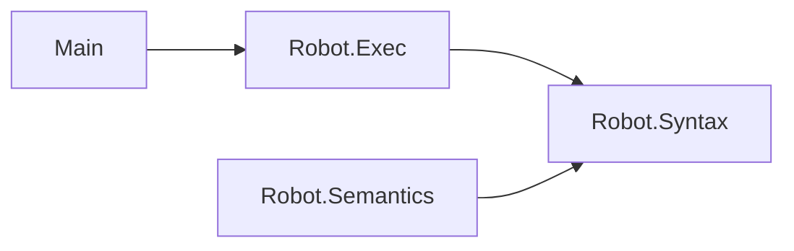

# 設計書の書き方

各Iterationでは，実装の前に設計書を更新し，実装の後で設計書と実装を見比べる．
このガイドでは，2つの設計書の書き方と検査の方法を説明する．
例には，Miniとは別の，ロボットに命令を与える小さな言語Robotを使う．

## 設計書の位置付け

各Iterationは，テストリスト → 設計書 → 実装 → 設計レビューの順に進める．

- テストリストは，何が成り立つべきか(振る舞いと性質)を並べる．
- 設計書は，それをどう実現するか(言語の定義とモジュールの構造)を書く．
- 設計レビューでは，実装を終えた後で設計書と実装を見比べ，食い違いを直す．

設計書は，各パッケージの`design/`に置く．

| ファイル | 内容 |
| --- | --- |
| `design/spec.md` | 言語仕様書．構文，意味，成り立つべき性質 |
| `design/modules.md` | モジュール依存図．各モジュールがどのモジュールをimportするか |

## 言語仕様書

言語仕様書は，言語の構文と意味を数式で定め，成り立つべき性質を並べた文書である．
Leanの定義とテストは，この文書を形式的に書き直したものになる．
次の3つの節からなる．

- `## 構文`：抽象構文のBNFと，Leanの構成子との対応．
- `## 意味`：評価の規則．関係ごとに`### <説明>\`<Leanの名前>\``の見出しを立て，その下に推論規則を書く．
- `## 型`：型の構文と型付け規則．型を持つ言語で，`## 意味`と同じ形で書く．
- `## 性質`：成り立つべき性質．`- \`<定理名>\`：<主張の説明>`の形で並べる．

### 数式の書き方

数式はTeXの記法で書く．
文中の数式は`$…$`で囲み，独立した数式は`math`のコードブロックに書く．

````markdown
文中の数式：命令$c$を実行する．

```math
c ::= \mathsf{fwd}\ n \mid \mathsf{turn} \mid c ; c
```
````

推論規則は，`\frac{前提}{結論}`で分数の形に書き，右に`\textsf{規則名}`を付ける．
前提のない規則は，分子を空(`\frac{}{結論}`)にする．
規則名は，その規則に対応するLeanの構成子の名前と同じにする．

### 例：Robotの言語仕様書

````markdown
# 言語仕様書

## 構文

```math
\begin{array}{rcll}
c & ::= & \mathsf{fwd}\ n & \text{n歩進む} \\
  & \mid & \mathsf{turn} & \text{向きを変える} \\
  & \mid & c ; c & \text{続けて実行する}
\end{array}
```

## 意味

### 命令の実行`Run`

$\langle c, p \rangle \Downarrow p'$は，位置$p$で命令$c$を実行すると位置$p'$になることを表す．

```math
\frac{}{\langle \mathsf{fwd}\ n, p \rangle \Downarrow p + n}\ \textsf{fwd}
\qquad
\frac{}{\langle \mathsf{turn}, p \rangle \Downarrow -p}\ \textsf{turn}
```

```math
\frac{\langle c_1, p \rangle \Downarrow p' \quad \langle c_2, p' \rangle \Downarrow p''}
     {\langle c_1 ; c_2, p \rangle \Downarrow p''}\ \textsf{seq}
```

## 性質

- `run_deterministic`：同じ位置で同じ命令を実行すると，結果の位置は1つに決まる．
````

この文書は，次のように表示される(`## 意味`の部分)．

```math
\frac{}{\langle \mathsf{fwd}\ n, p \rangle \Downarrow p + n}\ \textsf{fwd}
\qquad
\frac{}{\langle \mathsf{turn}, p \rangle \Downarrow -p}\ \textsf{turn}
```

```math
\frac{\langle c_1, p \rangle \Downarrow p' \quad \langle c_2, p' \rangle \Downarrow p''}
     {\langle c_1 ; c_2, p \rangle \Downarrow p''}\ \textsf{seq}
```

対応するLeanの定義は次のとおりである．
見出しの`Run`が型の名前に，規則名`fwd`，`turn`，`seq`が構成子の名前に対応する．

```lean
inductive Run : Cmd → Int → Int → Prop where
  | fwd {n : Nat} {p : Int} : Run (.fwd n) p (p + n)
  | turn {p : Int} : Run .turn p (-p)
  | seq {c₁ c₂ : Cmd} {p p' p'' : Int} : Run c₁ p p' → Run c₂ p' p'' → Run (.seq c₁ c₂) p p''
```

## モジュール依存図

モジュール依存図は，ライブラリの各モジュールとコマンド`Main`が，どのモジュールをimportしているかを示す図である．
Mermaidのflowchartで描く．

- ノードには，`Run["Robot.Run"]`のように，Leanのモジュール名をラベルとして付ける．
- `A`が`B`をimportしているとき，`A --> B`と矢印を引く．
- ライブラリの入口(`Robot.lean`のような，各モジュールをimportするだけのファイル)とLeanの標準ライブラリは描かない．
- 図の下に，各モジュールの役割と，図では表せない約束を箇条書きで書く．

### 例：Robotのモジュール依存図

````markdown


- `Robot.Syntax`：命令の抽象構文`Cmd`．
- `Robot.Semantics`：命令の実行`Run`．
- `Robot.Exec`：命令を実行する関数`exec`．
- `Main`：コマンド`robot`．
````

この図は，次のように表示される．


## 書くときの約束

- 設計書の名前(構成子，関係，関数，モジュール，定理)は，Leanのコードの名前と一致させる．
- 1つの図や1つの節には，1つの観点だけを書く．
- 図や規則の前に，それが何を表すかを1〜2文で書く．
- 図や数式で表せない約束は，その下に箇条書きで書く．
- 設計書には，その時点のプログラムの状態だけを書く．過去の版との違いは書かない．

## 表示と検査

VSCodeでMarkdownファイルを開き，コマンドパレットでMarkdown Preview Enhancedのプレビューを開くと，数式とMermaidの図を表示しながら書ける．
コマンドの名前は「Markdown Preview Enhanced: Open Preview to the Side」である．

設計書の検査は，リポジトリのルートで次のコマンドを実行する．

| 操作 | コマンド |
| --- | --- |
| 数式とMermaidの図の構文を検査する | `mise run lint` |
| 設計書と実装を照合する | パッケージのディレクトリで`mise run check-design` |

`mise run check-design`は，次の3点を照合し，食い違いを報告する．

- モジュール依存図の矢印と，`Mini/`と`Main.lean`のimport文．
- 言語仕様書の`## 意味`と`## 型`にある`### …\`Name\``の節の規則名と，`inductive Name`の構成子名．
- 言語仕様書の`## 性質`に挙げた定理名が，`MiniTest/`に`theorem`としてあること．

Iteration 0の演習で，モジュール依存図を描く前に実行すると，次のような行が報告される(最初の3行)．

```text
不一致 iterations/iteration-0/exercise
    iterations/iteration-0/exercise/design/modules.md: 図にないimport：Main -> Mini.Run
    iterations/iteration-0/exercise/design/modules.md: 図にないimport：Mini.Eval -> Mini.Syntax
```
