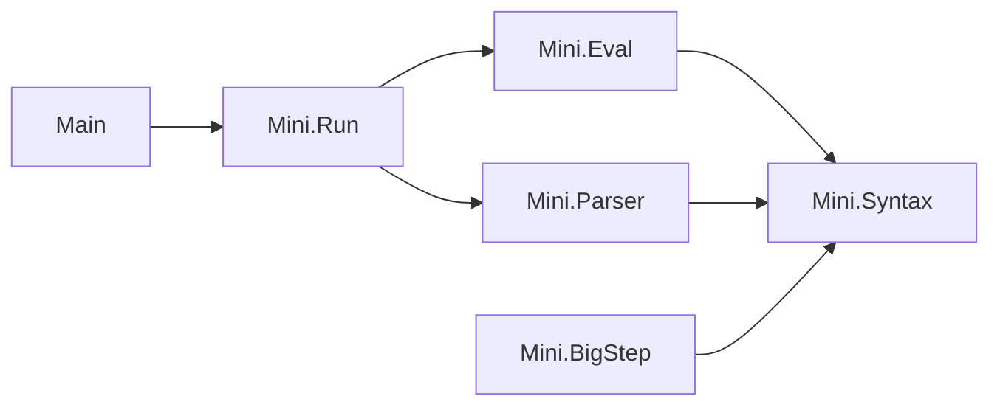

# モジュール依存図

ライブラリ`Mini`の各モジュールとコマンド`Main`が，どのモジュールをimportしているかを示す．
矢印`A --> B`は，`A`が`B`をimportしていることを表す．

- `Mini.Syntax`：式の抽象構文`Term`．
- `Mini.BigStep`：大ステップ意味論`Eval`(記法`t ⇓ n`)．
- `Mini.Eval`：評価器`eval`．
- `Mini.Parser`：配布された構文解析器`parse`．
- `Mini.Run`：構文解析と評価をつなぎ，表示する文字列を作る`run`．
- `Main`：コマンド`mini eval <式>`．
- `Mini.Eval`と`Mini.Parser`はどちらも`Mini.Syntax`だけに依存し，互いには依存しない．
- `Mini.BigStep`は仕様であり，実装のどのモジュールからも使われない．`eval`と`Eval`の関係は，テストの定理で結び付ける．
