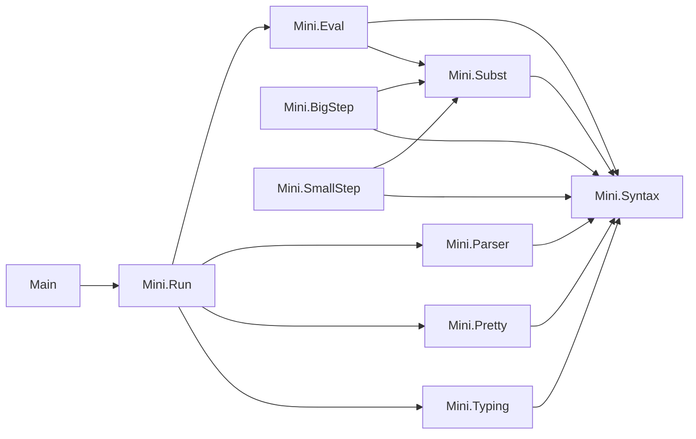

# モジュール依存図

ライブラリ`Mini`の各モジュールとコマンド`Main`が，どのモジュールをimportしているかを示す．
矢印`A --> B`は，`A`が`B`をimportしていることを表す．

- `Mini.Syntax`：型`Ty`，式の抽象構文`Term`，評価の結果の値`Value`，式を値にする`Term.toValue?`．
- `Mini.Subst`：置換`subst`．
- `Mini.Typing`：型付け文脈`Ctx`，型付け規則`HasType`，型エラー`TypeError`，型検査器`typeOf`．
- `Mini.BigStep`：大ステップ意味論`Eval`(記法`t ⇓ v`)．
- `Mini.SmallStep`：値を表す式`IsValue`，小ステップ意味論`Step`(記法`t ⟶ t'`)，多ステップ簡約`Steps`(記法`t ⟶* t'`)，正規形`Normal`と行き詰まった式`Stuck`．
- `Mini.Eval`：1ステップ簡約する関数`step`と，それを燃料の回数まで繰り返す評価器`eval`．
- `Mini.Pretty`：式と値と型を文字列にする`Term.pretty`，`Value.pretty`，`Ty.pretty`．関数と再帰関数の値は，その関数を表す式として表示する．
- `Mini.Parser`：配布された構文解析器`parse`．
- `Mini.Run`：構文解析と型検査と評価をつなぐ`run`，型を表示する`runCheck`，簡約列を表示する`runSteps`．型エラーと評価のエラーを文字列にする`TypeError.message`と`EvalError.message`もここに置く．
- `Main`：コマンド`mini eval <式>`，`mini steps <式>`，`mini check <式>`と，燃料を指定するオプション`--fuel`．
- `Mini.Eval`と`Mini.Parser`はどちらも`Mini.Syntax`だけに依存し，互いには依存しない．
- `Mini.BigStep`と`Mini.SmallStep`は仕様であり，実装のどのモジュールからも使われない．実装との関係は，テストの定理で結び付ける．
